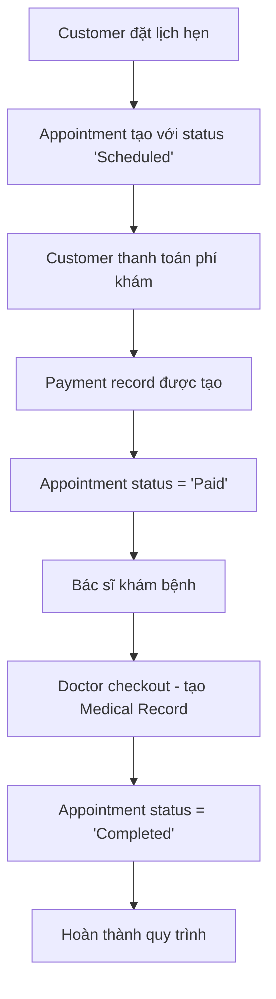

# Hệ thống Checkout - ITMMS

## Tổng quan

Hệ thống checkout trong ITMMS bao gồm hai loại checkout chính:

1. **Customer Checkout**: Bệnh nhân thanh toán phí khám sau khi đặt lịch hẹn
2. **Doctor Checkout**: Bác sĩ hoàn thành cuộc hẹn và tạo hồ sơ bệnh án

## Luồng hoạt động (Workflow)



## API Endpoints

### 1. Customer Checkout
**POST** `/api/checkout/customer`

Cho phép bệnh nhân thanh toán phí khám.

**Request Body:**
```json
{
  "appointmentId": 1,
  "paymentMethod": "Card", // Cash, Card, Transfer, Insurance
  "transactionId": "TXN_20250623123456"
}
```

**Response:**
```json
{
  "success": true,
  "message": "Thanh toán thành công",
  "data": {
    "paymentId": 1,
    "amount": 500000,
    "transactionId": "TXN_20250623123456"
  }
}
```

**Business Logic:**
- Kiểm tra appointment tồn tại và ở trạng thái "Scheduled"
- Kiểm tra chưa thanh toán trước đó
- Tạo Payment record
- Cập nhật appointment PaymentStatus = "Paid"

### 2. Doctor Checkout
**POST** `/api/checkout/doctor/{doctorId}`

Cho phép bác sĩ hoàn thành cuộc hẹn và tạo hồ sơ bệnh án.

**Request Body:**
```json
{
  "appointmentId": 1,
  "diagnosis": "Hiếm muộn do rối loạn nội tiết tố",
  "treatment": "Điều trị hormone, theo dõi chu kỳ kinh nguyệt",
  "prescription": "Clomiphene citrate 50mg x 5 ngày/chu kỳ",
  "notes": "Bệnh nhân cần tái khám sau 1 tháng",
  "followUpRequired": true,
  "nextAppointmentDate": "2025-07-24T10:00:00"
}
```

**Response:**
```json
{
  "success": true,
  "message": "Hoàn thành cuộc hẹn và ghi nhận hồ sơ bệnh án thành công",
  "data": {
    "medicalRecordId": 1,
    "appointmentId": 1,
    "completedAt": "2025-06-23T13:00:00"
  }
}
```

**Business Logic:**
- Kiểm tra appointment thuộc về doctor
- Kiểm tra appointment đã được thanh toán
- Tạo Medical Record với thông tin khám bệnh
- Cập nhật appointment Status = "Completed"
- Ghi nhận follow-up requirement

### 3. Xem thông tin thanh toán
**GET** `/api/checkout/payment/appointment/{appointmentId}`

**GET** `/api/checkout/payments/customer/{customerId}`

### 4. Test endpoint
**GET** `/api/checkout/test`

## Database Schema Updates

### Appointment Table - Thêm các trường:
- `Fee` (decimal): Phí khám
- `PaymentStatus` (string): Trạng thái thanh toán
- `PaidAt` (datetime): Thời gian thanh toán
- `CompletedAt` (datetime): Thời gian hoàn thành

### Payment Table - Mới:
- `Id` (int): Primary key
- `AppointmentId` (int): Foreign key
- `CustomerId` (int): Foreign key
- `Amount` (decimal): Số tiền
- `PaymentMethod` (string): Phương thức thanh toán
- `Status` (string): Trạng thái thanh toán
- `TransactionId` (string): Mã giao dịch
- `CreatedAt` (datetime): Thời gian tạo
- `PaidAt` (datetime): Thời gian thanh toán

## Services

### CheckoutService
Implement `ICheckoutService` với các methods:
- `CustomerCheckout(CustomerCheckoutDto)`: Xử lý thanh toán customer
- `DoctorCheckout(int doctorId, DoctorCheckoutDto)`: Xử lý checkout doctor
- `GetPaymentByAppointmentId(int)`: Lấy thông tin thanh toán
- `GetPaymentsByCustomerId(int)`: Lịch sử thanh toán

### AppointmentService - Updates
- Tự động set `Fee` từ `doctor.ConsultationFee` khi tạo appointment
- Set `PaymentStatus = "Pending"` ban đầu

## Validation và Error Handling

### Customer Checkout:
- ✅ Appointment phải tồn tại
- ✅ Appointment phải ở trạng thái "Scheduled"
- ✅ Chưa được thanh toán trước đó
- ✅ PaymentMethod hợp lệ

### Doctor Checkout:
- ✅ Appointment phải thuộc về doctor
- ✅ Appointment phải đã được thanh toán
- ✅ Appointment chưa được completed
- ✅ Tạo Medical Record với đầy đủ thông tin

## Testing

Sử dụng script `test-checkout.ps1` để test toàn bộ workflow:

```powershell
.\test-checkout.ps1
```

Test flow:
1. Tạo appointment mới
2. Customer checkout (thanh toán)
3. Kiểm tra payment status
4. Doctor checkout (hoàn thành)
5. Kiểm tra final status
6. Xem payment history

## Use Cases Thực tế

### Use Case 1: Thanh toán tiền mặt
```json
{
  "appointmentId": 1,
  "paymentMethod": "Cash",
  "transactionId": null
}
```

### Use Case 2: Thanh toán bảo hiểm
```json
{
  "appointmentId": 1,
  "paymentMethod": "Insurance",
  "transactionId": "INS_2025062312345"
}
```

### Use Case 3: Khám xong cần tái khám
```json
{
  "appointmentId": 1,
  "diagnosis": "IVF preparation",
  "treatment": "Hormone stimulation protocol",
  "followUpRequired": true,
  "nextAppointmentDate": "2025-07-15T09:00:00"
}
```

## Tính năng mở rộng

### Đã implement:
- ✅ Payment tracking
- ✅ Medical record creation
- ✅ Follow-up scheduling
- ✅ Transaction ID tracking
- ✅ Multiple payment methods

### Có thể mở rộng:
- 📝 Payment gateway integration
- 📝 Invoice generation
- 📝 SMS/Email notifications
- 📝 Refund handling
- 📝 Partial payments
- 📝 Insurance claim processing

## Security Considerations

- ✅ Doctor chỉ có thể checkout appointments của mình
- ✅ Validate appointment ownership
- ✅ Prevent double payment
- ✅ Audit trail cho all transactions
- ✅ JsonIgnore sensitive navigation properties

## Monitoring và Logging

Tất cả checkout operations được log với:
- Timestamp
- User/Doctor ID
- Appointment ID
- Amount (for payments)
- Transaction status
- Error details (nếu có)

---

**Trạng thái**: ✅ **HOÀN THÀNH**

Hệ thống checkout đã sẵn sàng để sử dụng trong môi trường production với đầy đủ tính năng theo yêu cầu của thầy. 