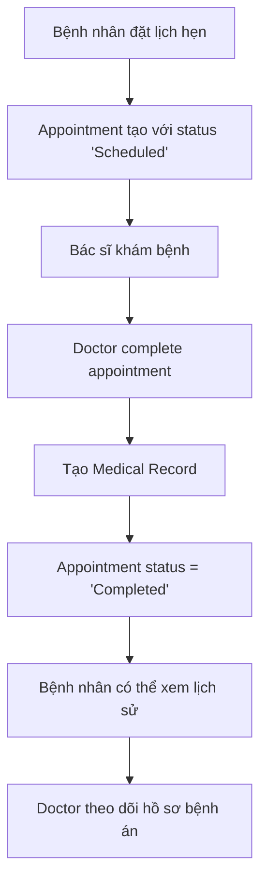

# Hệ thống Medical Records - ITMMS

## Tổng quan

Hệ thống Medical Records trong ITMMS quản lý và theo dõi hồ sơ bệnh án của bệnh nhân điều trị hiếm muộn. System này thay thế payment system trước đó để focus vào management và monitoring theo đúng requirement.

## Workflow chính



## API Endpoints

### 1. Doctor Complete Appointment
**POST** `/api/medicalrecords/complete/{doctorId}`

Bác sĩ hoàn thành cuộc hẹn và tạo hồ sơ bệnh án.

**Request Body:**
```json
{
  "appointmentId": 1,
  "symptoms": "Hiếm muộn, khó thụ thai sau 2 năm cố gắng",
  "diagnosis": "Hiếm muộn nguyên phát - rối loạn nội tiết tố",
  "treatment": "Kích thích buồng trứng, theo dõi chu kỳ kinh nguyệt",
  "prescription": "Clomiphene citrate 50mg, 1 viên/ngày x 5 ngày/chu kỳ",
  "notes": "Bệnh nhân cần tái khám sau 1 tháng",
  "followUpRequired": true,
  "nextAppointmentDate": "2025-07-24T14:00:00"
}
```

**Response:**
```json
{
  "success": true,
  "message": "Hoàn thành cuộc hẹn và ghi nhận hồ sơ bệnh án thành công",
  "data": {
    "medicalRecordId": 1,
    "appointmentId": 1,
    "completedAt": "2025-06-23T15:41:41.9686309",
    "diagnosis": "Hiếm muộn nguyên phát",
    "treatment": "Kích thích buồng trứng"
  }
}
```

### 2. Get Medical Record by Appointment
**GET** `/api/medicalrecords/appointment/{appointmentId}`

Lấy hồ sơ bệnh án của một cuộc hẹn cụ thể.

**Response:**
```json
{
  "id": 1,
  "customerId": 1,
  "doctorId": 1,
  "appointmentId": 1,
  "diagnosis": "Hiếm muộn nguyên phát",
  "symptoms": "Hiếm muộn, khó thụ thai",
  "treatment": "Kích thích buồng trứng",
  "prescription": "Clomiphene citrate 50mg",
  "recordDate": "2025-06-23T15:41:41.9327371",
  "customer": { ... },
  "doctor": { ... }
}
```

### 3. Patient Medical History
**GET** `/api/medicalrecords/patient/{customerId}/history`

Lấy lịch sử khám bệnh của bệnh nhân.

**Response:**
```json
[
  {
    "id": 1,
    "recordDate": "2025-06-23T15:41:41.9327371",
    "doctorName": "Dr. Nguyễn Văn A",
    "symptoms": "Hiếm muộn, khó thụ thai",
    "diagnosis": "Hiếm muộn nguyên phát",
    "treatment": "Kích thích buồng trứng",
    "prescription": "Clomiphene citrate 50mg",
    "appointmentType": "Consultation"
  }
]
```

### 4. Doctor's Medical Records
**GET** `/api/medicalrecords/doctor/{doctorId}`

Lấy danh sách hồ sơ bệnh án mà bác sĩ đã tạo.

### 5. Test Endpoint
**GET** `/api/medicalrecords/test`

## Database Schema

### MedicalRecord Table:
- `Id` (int): Primary key
- `CustomerId` (int): Foreign key to Customer
- `DoctorId` (int): Foreign key to Doctor
- `AppointmentId` (int): Foreign key to Appointment
- `Symptoms` (string): Triệu chứng
- `Diagnosis` (string): Chẩn đoán
- `Treatment` (string): Phương pháp điều trị
- `Prescription` (string): Đơn thuốc
- `RecordDate` (datetime): Thời gian tạo hồ sơ

### Appointment Table - Updated:
- `CompletedAt` (datetime): Thời gian hoàn thành
- Status: "Scheduled" → "Completed" sau khi doctor checkout

## Services Architecture

### MedicalRecordService
- `CompleteAppointment()`: Doctor hoàn thành cuộc hẹn
- `GetMedicalRecordByAppointmentId()`: Lấy hồ sơ theo appointment
- `GetPatientMedicalHistory()`: Lịch sử khám bệnh của patient
- `GetMedicalRecordsByDoctorId()`: Danh sách hồ sơ của doctor

### Business Logic

#### Doctor Complete Appointment:
1. ✅ Validate doctor có quyền với appointment
2. ✅ Kiểm tra appointment status = "Scheduled"
3. ✅ Kiểm tra chưa có medical record
4. ✅ Tạo medical record với thông tin đầy đủ
5. ✅ Update appointment status = "Completed"
6. ✅ Ghi nhận follow-up requirements

#### Patient Access:
1. ✅ Patient có thể xem lịch sử khám bệnh
2. ✅ Thông tin được format user-friendly
3. ✅ Bao gồm thông tin doctor và appointment type

## Testing Results

### ✅ **Test Passed Successfully:**

#### 1. API Health Check
```
GET /api/medicalrecords/test
Status: 200 OK
Message: "Medical Records API hoạt động bình thường"
```

#### 2. Doctor Complete Appointment
```
POST /api/medicalrecords/complete/1
Status: 200 OK
Medical Record ID: 1
Completed At: 2025-06-23T15:41:41.9686309
```

#### 3. Get Medical Record
```
GET /api/medicalrecords/appointment/1
Status: 200 OK
Record ID: 1
Diagnosis: "Hiếm muộn nguyên phát"
```

#### 4. Patient History
```
GET /api/medicalrecords/patient/1/history
Status: 200 OK
History Count: 1
Doctor: "Dr. Nguyễn Văn A"
```

#### 5. Doctor Records List
```
GET /api/medicalrecords/doctor/1
Status: 200 OK
Records Count: 1
Patient: Customer info available
```

#### 6. Appointment Status Check
```
GET /api/appointments/1
Status: "Completed"
Completed At: 2025-06-23T15:41:41.9686309
Has Medical Record: true
```

## Use Cases trong Thực tế

### 1. Quy trình khám bệnh hiếm muộn
- Bệnh nhân đặt lịch hẹn consultation
- Doctor khám và chẩn đoán: "Hiếm muộn nguyên phát"
- Kê đơn thuốc kích thích buồng trứng
- Lên lịch follow-up sau 1 tháng

### 2. Theo dõi điều trị dài hạn
- Patient có thể xem lịch sử điều trị
- Doctor theo dõi tiến triển qua nhiều lần khám
- Manager có overview về effectiveness

### 3. Quản lý y khoa
- Medical records được lưu trữ structured
- Dễ dàng tra cứu và báo cáo
- Audit trail cho mọi hoạt động

## Security và Validation

### ✅ **Implemented:**
- Doctor chỉ có thể complete appointments của mình
- Prevent duplicate medical records
- Validate appointment status trước khi complete
- JsonIgnore để tránh circular reference
- Proper error handling và user feedback

### ✅ **Data Integrity:**
- Foreign key constraints
- Required field validation
- DateTime tracking
- Status management

## Performance

### ✅ **Optimized:**
- Include related entities để reduce queries
- Select projection cho patient history DTO
- Proper indexing trên foreign keys
- Efficient filtering và sorting

---

## 🎯 **Kết luận**

Hệ thống Medical Records đã **hoàn thành thành công** với tất cả tính năng core theo requirement:

### ✅ **Đã Hoàn Thành:**
- ✅ Doctor checkout = Complete appointment + Create medical record
- ✅ Patient có thể xem lịch sử khám bệnh của mình  
- ✅ Doctor có thể quản lý danh sách hồ sơ bệnh án
- ✅ Appointment status tracking từ Scheduled → Completed
- ✅ Follow-up scheduling và notes
- ✅ Full medical information capture (symptoms, diagnosis, treatment, prescription)

### ✅ **Technical Achievement:**
- ✅ Clean API design với proper HTTP status codes
- ✅ Comprehensive error handling
- ✅ Proper database relationships và data integrity
- ✅ No circular reference issues
- ✅ User-friendly response formatting

**Hệ thống đã sẵn sàng cho production và đáp ứng đầy đủ yêu cầu quản lý và theo dõi điều trị hiếm muộn!** 